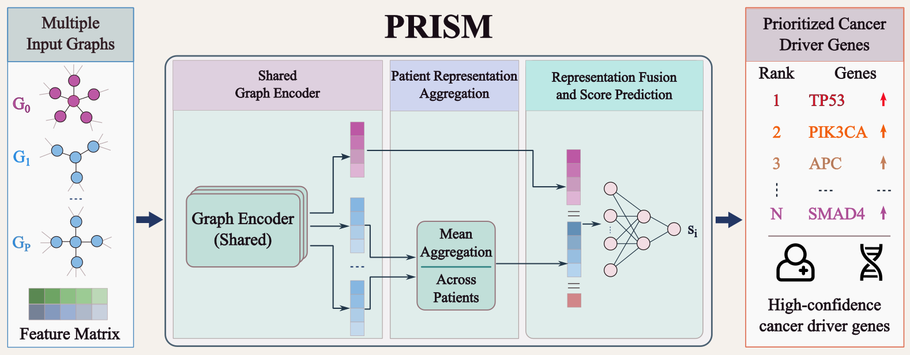

# PRISM: Patient-specific Representation Integration with a Shared Graph Model for Cancer Driver Gene Prioritization

PRISM is a graph neural network framework for cancer driver gene prioritization that integrates a shared protein–protein interaction (PPI) network with patient-specific gene interaction graphs derived from single-cell RNA sequencing (scRNA-seq) data. By combining auxiliary multi-cancer pretraining with target-specific fine-tuning, PRISM learns transferable biological representations that improve the prioritization of cancer driver genes across multiple cancer types.

---

## Model Framework



PRISM consists of four major stages:

PRISM consists of four major stages:

1. **Reference Graph Encoding**
   - A high-confidence PPI network from ConsensusPathDB (CPDB) is used as the shared biological backbone.

2. **Patient-specific Graph Learning**
   - Patient-specific gene interaction graphs are constructed from scRNA-seq data using CellPhoneDB.
   - A shared graph encoder extracts representations from both the reference PPI network and individual patient graphs.

3. **Auxiliary Multi-cancer Pretraining**
   - The shared encoder is pretrained on multiple non-target cancer types to learn transferable biological knowledge.

4. **Target-specific Fine-tuning**
   - The pretrained model is fine-tuned on the target cancer to prioritize candidate driver genes.

---

## Requirements

- Python 3.9+
- PyTorch
- PyTorch Geometric
- NumPy
- pandas
- scikit-learn

Install the required packages:

```bash
pip install -r requirements.txt
```

---

## Data

The experiments use publicly available datasets from the following resources:

- **ConsensusPathDB (CPDB):** reference protein–protein interaction network.
- **The Cancer Genome Atlas (TCGA):** multi-omics features and cancer driver gene labels.
- **Gene Expression Omnibus (GEO):** public scRNA-seq datasets used to construct patient-specific gene interaction graphs with CellPhoneDB.

All datasets are organized under the `Data/` directory.

```text
Data/
├── PPI/
├── features/
├── labels/
└── scRNA/
```

---

## Repository Structure

```text
ICTA2026/
├── README.md
├── requirements.txt
├── pretrain.py
├── train.py
├── model.py
├── utils.py
└── Data/
    ├── PPI/
    ├── features/
    ├── labels/
    └── scRNA/
```

---

## Usage

Install the required packages:

```bash
pip install -r requirements.txt
```

Run auxiliary pretraining:

```bash
python pretrain.py
```

Run target-specific fine-tuning:

```bash
python train.py
```

---

## License

This repository is intended for academic research purposes.
